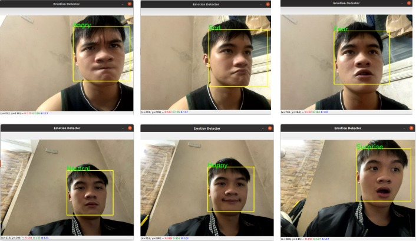
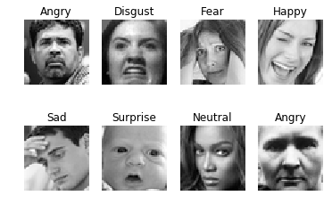

# Emotion-Classification
Build a real-time emotion classification model based on CNN, Vgg16 and Resnet

## About 
A project to classify human emotions in real time with 7 types of emotions:
* Happy 😄
* Angry 😡
* Fear 😨
* Neutral 😐
* Sad 😢
* Surprised 😲
* Disgust 🤢

## Example Result
Results when using real-time emotion classification model:

 

## Installation
```
$ git clone https://github.com/KhoiNghiem/Emotion-Classification.git
$ cd Emotion-Classification
$ pip install -r requirements.txt
```

## Dataset
FER2013 consists of 28,709/7,178 train/test 48x48 pixel grayscale images of faces annotated with the emotion of facial expression as one of seven categories (0=Angry, 1=Disgust, 2=Fear, 3=Happy, 4=Sad, 5=Surprise, 6=Neutral). The faces have been automatically registered so that the face is more or less centered and occupies about the same amount of space in each image.
Thanks to its resolution this is a good trade-off between accuracy and model complexity allowing to iterate quickly many times. You need to download the dataset from [Kaggle]([https://www.kaggle.com/c/challenges-in-representation-learning-facial-expression-recognition-challenge/data](https://www.kaggle.com/datasets/msambare/fer2013))


 


## Usage
In src, change to your model, then run
```
python3 main.py
```
## Code explanation
The src folder contains jupyter notebook files for training models including:
* Base CNN - `CNN.ipynb`
* ResNet50 V2 Base - `ResNet50V2.ipynb`
* VGG16 and ResNet50 V2 with data augumentation - `VGG16_ResNes50V2_au.ipynb`

Object detection module with Haar Cascades 
```
haarcascade_frontalface_default.xml
```
Run `python3 main.py` file to perform real-time emotion classification

Note: For each transfer learning model with input to 244x244

## Reference
* Kaggle dataset: https://www.kaggle.com/datasets/msambare/fer2013
* ResNet50 V2: https://keras.io/api/applications/resnet/
* Vgg 16: https://keras.io/api/applications/vgg/
